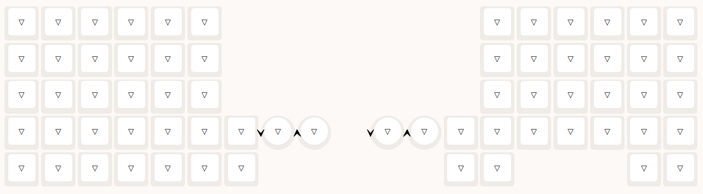

# MCK Trackball 59

This keyboard is a [Keyball 61](https://shirogane-lab.net/items/64b8ed191435c1002bc4cd30) lookalike from AliExpress. Despite the looks, internally it is heavily "inspired" by Slinky-based [Charybdis](https://bastardkb.com).

Despite this "inspiration", the guy making these keyboards is reluctant to comply with QMK's and Vial's licence (GPL 2) and make the firmware source code available.

No shits given, it's a buggy mess anyway. Here I implement a much better firmware for this keyboard, complete with everything I personally want from a keyboard.

This should go without saying, but **Feel free to fork and make your own version!**

## Features

- All keys assignable through Vial (keys are organised in rows, so that you don't have to click each key individually, unlike the stock experience)
- RGB LED Matrix support (stock firmware does it wrong btw)
- Full encoder support (unlike in stock, the directions are correct -- for both of them)
- Full trackball support: pointing, sniping, scrolling, sniping while scrolling, all with adjustable sensitivities
- Key locking: you can lock Shift, or scrolling, or sniping... up to 16 keys at a time (configurable in the source code)
- Turbo keys: you can make up to 16 keys turbo, meaning they fire every 80 ms (configurable) while held
- Turbo locking: you can use key locking and turbo together!
- Persistent config on demand: sensitivity settings can be saved to EEPROM by a key press
- "Natural scrolling" (can be disabled in keymap's `config.h`)
- Left OLED display shows Lock and Turbo status (up to 16 enries each)
- Right OLED display shows sensitivity settings

## Missing features

- The board is wired in a way that doesn't allow using both sides as master easily; it could be fixed, especially with hardware mods, but I don't currently possess the time for such endeavours. For now, the firmware only works properly when connected to the left side
- I don't plan to implement the furries
- I don't plan to implement auto mouse layer
- I won't implement the exact keycodes from the stock firmware, as my vision is more UNIX-like

## Locking

Press Lock, and then the key you want to lock pressed.

Pressing Lock again before any other key will cancel the lock if you hit it accidentally.

Once locked, press the locked key again to unlock it.

You can lock virtually any key, up to 16 of them (adjusted in source).

Once you hit the limit on locked keys you can no longer lock any keys until you unlock some.

## Turbo

Press Turbo, and then the key you want to turbocharge.

Pressing Turbo again before any other key will cancel it, in case you changed your mind.

Once turbocharged, the key will fire pressed/released events every 80 ms (adjustable in source) while held.

You don't have to hold it manually, as you can just Lock it instead.

To discharge the key, press Turbo and then the turbocharched key again.

You can turbocharge up to 16 keys simultaneously (adjusted in source).

Once you hit the limit on turbocharged keys you can no longer turbocharge any more until you discharge some.

## Scrolling

Hold Scroll and move the trackball.

Use Lock Scroll to lock the trackball in scrolling mode.

While scrolling, adjusting the sensitivity will adjust the scrolling-specific sensitivity in increments of 100.

Sniping while scrolling will scroll with sniping sensitivity.

## Sniping

Hold Snipe to temporarily change the sensitivity.

Use Lock Snipe to easily shift between two sensitivity presets.

While sniping, adjusting the sensitivity will adjust the sniping-specific sensitivity in increments of 100 -- even while scrolling.

## Tips and tricks

Putting sensitivity adjustment on encoder is a great idea.
